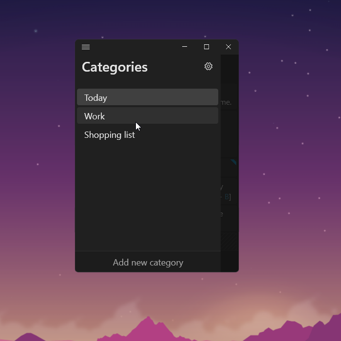
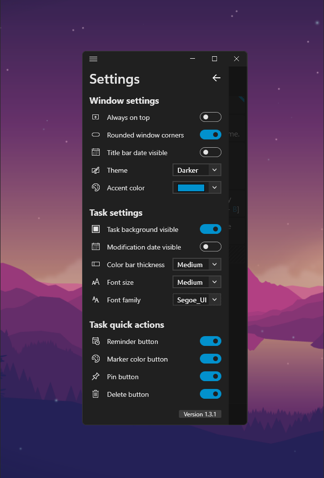

# TodoApp2
A customizable and portable WPF ToDo application.

## Simple dark theme

## Context menu

## Customize it however you like

## Categorize your tasks

## Set reminders

## Use it as a widget
See: Settings menu -> Always on top

## Lot of options to customize the interface

